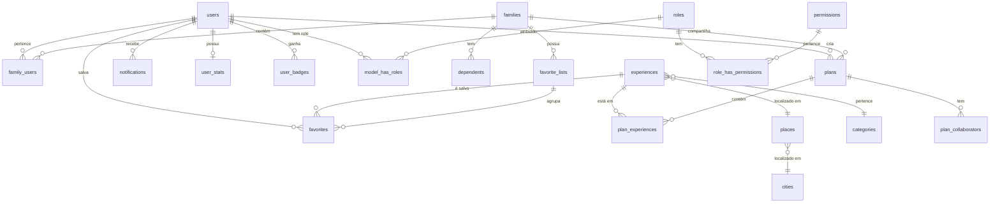

# 🗄️ Database Schema - Relacionamentos

> **Atualizado:** 2026-01-18

---

## 📊 Diagrama de Relacionamentos



---

## 📑 Tabelas por Módulo

### 🔐 Autenticação & Usuários

| Tabela | Descrição | FK |
|--------|-----------|-----|
| `users` | Usuários do app | - |
| `otp_requests` | Códigos OTP | user_id? |
| `refresh_tokens` | Tokens de refresh | user_id |
| `device_sessions` | Sessões por device | user_id |
| `sessions` | Sessões Laravel | user_id |

---

### 👨‍👩‍👧‍👦 Família

| Tabela | Descrição | FK |
|--------|-----------|-----|
| `families` | Famílias | owner_id → users |
| `family_users` | Membros da família | family_id, user_id |
| `dependents` | Crianças/dependentes | family_id |
| `family_preferences` | Preferências | family_id |
| `family_preference_categories` | Categorias preferidas | family_id, category_id |
| `family_invites` | Convites | family_id, invited_by |
| `family_invite_uses` | Uso dos convites | invite_id, user_id |

**Roles em family_users:**
- `admin` - Pode gerenciar família
- `member` - Membro comum

---

### 🗺️ Locais & Experiências

| Tabela | Descrição | FK |
|--------|-----------|-----|
| `cities` | Cidades | - |
| `places` | Lugares | city_id |
| `categories` | Categorias | - |
| `experiences` | Experiências | place_id, category_id |
| `experience_search` | Read model p/ busca | experience_id |
| `place_opening_hours` | Horários | place_id |

**Status de experiences:**
- `draft` - Rascunho
- `pending_review` - Aguardando moderação
- `published` - Publicada
- `archived` - Arquivada

---

### ❤️ Favoritos

| Tabela | Descrição | FK |
|--------|-----------|-----|
| `favorite_lists` | Listas de favoritos | family_id, user_id |
| `favorites` | Experiências salvas | user_id, family_id, experience_id, list_id |

**Scope de favorites:**
- `user` - Apenas para o usuário
- `family` - Visível para família

---

### 📅 Planos

| Tabela | Descrição | FK |
|--------|-----------|-----|
| `plans` | Planos de passeio | user_id, family_id |
| `plan_collaborators` | Colaboradores | plan_id, user_id, invited_by |
| `plan_experiences` | Experiências do plano | plan_id, experience_id |

**Status de plans:**
- `draft` - Rascunho
- `planned` - Agendado
- `in_progress` - Em andamento
- `completed` - Concluído

**Roles em plan_collaborators:**
- `owner` - Criador do plano
- `editor` - Pode editar
- `viewer` - Apenas visualiza

---

### 📸 Memórias

| Tabela | Descrição | FK |
|--------|-----------|-----|
| `memories` | Fotos/Memórias | user_id, family_id, experience_id |
| `memory_reactions` | Reações | memory_id, user_id |
| `memory_comments` | Comentários | memory_id, user_id |

---

### ⭐ Reviews

| Tabela | Descrição | FK |
|--------|-----------|-----|
| `reviews` | Avaliações | user_id, experience_id |
| `review_votes` | Votos útil/não útil | review_id, user_id |
| `review_replies` | Respostas | review_id, user_id |

---

### 🔔 Notificações

| Tabela | Descrição | FK |
|--------|-----------|-----|
| `notifications` | Notificações | user_id |
| `notification_settings` | Configurações | user_id |
| `push_subscriptions` | Web push tokens | user_id |

**Tipos de notification:**
- `experience_nearby`
- `family_invite`
- `memory_reaction`
- `memory_comment`
- `plan_reminder`
- `plan_invite`
- `review_reply`
- `trending`
- `system`
- `referral_reward`

---

### 🏆 Gamificação

| Tabela | Descrição | FK |
|--------|-----------|-----|
| `user_stats` | XP, level, streaks | user_id |
| `user_badges` | Badges conquistados | user_id |

**Badges disponíveis:**
- `explorer` - Visitou X experiências
- `reviewer` - Fez X reviews
- `social` - Convidou X pessoas
- `planner` - Criou X planos
- `streak_7` - 7 dias seguidos
- `first_save` - Primeiro favorito

---

### 🔐 Permissões (Spatie)

| Tabela | Descrição |
|--------|-----------|
| `roles` | Roles do sistema |
| `permissions` | Permissões |
| `model_has_roles` | User → Role |
| `model_has_permissions` | User → Permission direta |
| `role_has_permissions` | Role → Permissions |

**Roles padrão:**
| Role | Descrição |
|------|-----------|
| `super-admin` | Acesso total |
| `admin` | Administrador |
| `moderator` | Modera conteúdo |
| `editor` | Edita experiências |
| `user` | Usuário padrão |
| `premium` | Usuário premium |

**Permissões:**
```
users.view, users.create, users.update, users.delete
experiences.view, experiences.create, experiences.update, experiences.delete, experiences.approve
reviews.view, reviews.moderate, reviews.delete
reports.view, reports.resolve
places.view, places.create, places.update, places.delete
categories.manage
collections.manage
analytics.view
settings.manage
```

---

### 📊 Analytics

| Tabela | Descrição | FK |
|--------|-----------|-----|
| `events_raw` | Eventos brutos | user_id?, target_id |
| `experience_metrics_daily` | Métricas agregadas | experience_id |
| `city_weather_cache` | Cache de clima | city_id |

---

### 🎯 Collections

| Tabela | Descrição | FK |
|--------|-----------|-----|
| `collections` | Listas curadas | city_id? |
| `collection_items` | Experiências | collection_id, experience_id |

---

## 🧪 Seeder de Teste

Para popular todas as tabelas com dados de teste:

```bash
php artisan db:seed --class=TestDataSeeder
```

**Dados criados:**
- 6 roles + 19 permissions
- 8 cidades
- 8 categorias
- 6 lugares
- 6 experiências
- 10 usuários (4 admin/mod/editor, 6 normais)
- 3 famílias com dependentes
- 12+ listas de favoritos
- Favoritos, planos, notificações, gamificação

---

## 📝 Queries Úteis

### Verificar roles de um usuário
```sql
SELECT u.name, r.name as role
FROM users u
JOIN model_has_roles mhr ON mhr.model_id = u.id
JOIN roles r ON r.id = mhr.role_id
WHERE mhr.model_type = 'App\\Models\\User';
```

### Favoritos de uma família
```sql
SELECT f.*, e.title, fl.name as list_name
FROM favorites f
JOIN experiences e ON e.id = f.experience_id
LEFT JOIN favorite_lists fl ON fl.id = f.list_id
WHERE f.family_id = 'uuid';
```

### Planos com experiências
```sql
SELECT p.title, p.status, e.title as experience
FROM plans p
JOIN plan_experiences pe ON pe.plan_id = p.id
JOIN experiences e ON e.id = pe.experience_id
ORDER BY p.created_at DESC;
```

---

> **Última atualização:** 2026-01-18
