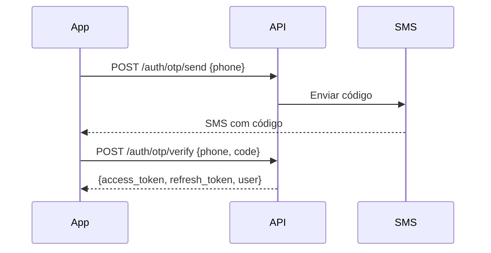

# 🎯 Bora Dia Família - API Backend

> **Plataforma de descoberta de experiências familiares**

[](https://laravel.com)
[](https://php.net)
[](https://mysql.com)
[](https://jwt.io)

---

## 📖 Sobre o Projeto

**Bora Dia Família** é uma plataforma para famílias descobrirem experiências incríveis para fazer juntas. O aplicativo usa inteligência para recomendar passeios, atividades e restaurantes baseados na idade das crianças, preferências da família, clima e nível de energia.

### 🎯 Problema que Resolve

- Pais perdem tempo buscando "o que fazer com as crianças"
- Dificuldade em encontrar lugares adequados para a idade dos filhos
- Falta de organização para planejar programas em família
- Esquecimento de experiências vividas juntos

### 💡 Solução

- **Recomendações personalizadas** baseadas no perfil da família
- **Filtros inteligentes**: clima, duração, preço, faixa etária
- **Planejamento** de passeios com agenda integrada
- **Álbum de memórias** compartilhado entre a família
- **Gamificação** para engajar e recompensar exploradores

---

## 🛠️ Stack Tecnológica

### Backend
| Tecnologia | Versão | Uso |
|------------|--------|-----|
| **PHP** | 8.3 | Linguagem principal |
| **Laravel** | 12.x | Framework MVC |
| **MySQL/MariaDB** | 8.0+ | Banco de dados |
| **JWT** | - | Autenticação stateless |
| **Redis** | 7.x | Cache e filas (opcional) |

### Pacotes Principais
```json
{
  "php-open-source-saver/jwt-auth": "^2.0",
  "spatie/laravel-permission": "^6.0",
  "spatie/laravel-query-builder": "^6.0",
  "knuckleswtf/scribe": "^5.0"
}
```

### Infraestrutura
- **Servidor**: Nginx + PHP-FPM
- **Hospedagem**: Plesk (valorsc.com.br)
- **Storage**: Amazon S3 (uploads)
- **SMS**: Twilio (OTP)

---

## 📁 Arquitetura do Projeto

```
app/
├── Actions/              # Lógica de negócio isolada
│   ├── Auth/            # Ações de autenticação
│   └── Gamification/    # Sistema de XP e conquistas
├── Http/
│   ├── Controllers/V1/  # Controllers da API v1
│   ├── Requests/        # Form Requests (validação)
│   └── Middleware/      # Middlewares customizados
├── Models/              # Eloquent Models
├── Policies/            # Authorization Policies
├── Services/            # Serviços de domínio
└── Jobs/                # Background Jobs

database/
├── migrations/          # Schema do banco
├── seeders/             # Dados de teste
└── factories/           # Factories para testes

config/
├── auth.php             # Configuração JWT
├── scribe.php           # Documentação API
└── gamification.php     # Regras de XP
```

---

## 🚀 Instalação

### Requisitos
- PHP >= 8.3
- Composer >= 2.0
- MySQL >= 8.0 ou MariaDB >= 10.6
- Node.js >= 18 (para assets)

### Setup Local

```bash
# 1. Clonar repositório
git clone https://github.com/seu-usuario/bora-dia-familia-api.git
cd bora-dia-familia-api

# 2. Instalar dependências
composer install

# 3. Configurar ambiente
cp .env.example .env
php artisan key:generate
php artisan jwt:secret

# 4. Configurar banco de dados no .env
# DB_CONNECTION=mysql
# DB_HOST=127.0.0.1
# DB_DATABASE=bora_familia
# DB_USERNAME=root
# DB_PASSWORD=

# 5. Executar migrations e seeders
php artisan migrate
php artisan db:seed

# 6. Iniciar servidor
php artisan serve
```

### Deploy Produção

```bash
# No servidor após git pull
composer install --no-dev --optimize-autoloader
php artisan config:cache
php artisan route:cache
php artisan view:cache
php artisan migrate --force
```

---

## 🔐 Autenticação

A API usa **JWT (JSON Web Token)** para autenticação stateless.

### Fluxo de Login



### Usar o Token

```bash
curl -H "Authorization: Bearer {access_token}" \
     https://api.valorsc.com.br/api/v1/home?city_id=UUID
```

---

## 📡 Endpoints da API

### Base URL
```
Produção: https://api.valorsc.com.br/api/v1/
Local:    http://localhost:8000/api/v1/
```

### 🔓 Endpoints Públicos

| Método | Endpoint | Descrição |
|--------|----------|-----------|
| `GET` | `/health` | Health check da API |
| `GET` | `/config` | Configurações do app (energy levels, vibes) |
| `GET` | `/categories` | Lista de categorias |
| `GET` | `/cities` | Buscar cidades |
| `GET` | `/cities/{id}` | Detalhes da cidade |
| `POST` | `/auth/otp/send` | Enviar código OTP |
| `POST` | `/auth/otp/verify` | Verificar OTP e autenticar |
| `POST` | `/auth/refresh` | Renovar tokens |
| `GET` | `/resolve/{code}` | Resolver deep link |

### 🔒 Endpoints Autenticados

#### Autenticação & Usuário
| Método | Endpoint | Descrição |
|--------|----------|-----------|
| `POST` | `/auth/logout` | Fazer logout |
| `GET` | `/auth/me` | Dados do usuário logado |
| `PUT` | `/users/me` | Atualizar perfil |
| `PATCH` | `/users/me/avatar` | Atualizar avatar |
| `POST` | `/users/me/location` | Atualizar localização |
| `GET` | `/users/me/stats` | Estatísticas de gamificação |
| `DELETE` | `/users/me` | Desativar conta |

#### Onboarding
| Método | Endpoint | Descrição |
|--------|----------|-----------|
| `GET` | `/onboarding/status` | Status das etapas |
| `POST` | `/onboarding/complete` | Completar onboarding |

#### Home & Busca
| Método | Endpoint | Descrição |
|--------|----------|-----------|
| `GET` | `/home` | Feed personalizado |
| `GET` | `/experiences/search` | Buscar experiências |
| `GET` | `/experiences/{id}` | Detalhes da experiência |
| `GET` | `/map/experiences` | Experiências para mapa |

#### Reviews
| Método | Endpoint | Descrição |
|--------|----------|-----------|
| `GET` | `/experiences/{id}/reviews` | Listar reviews |
| `POST` | `/experiences/{id}/reviews` | Criar review |
| `PUT` | `/reviews/{id}` | Atualizar review |
| `DELETE` | `/reviews/{id}` | Excluir review |
| `POST` | `/reviews/{id}/helpful` | Marcar como útil |

#### Favoritos
| Método | Endpoint | Descrição |
|--------|----------|-----------|
| `GET` | `/favorites` | Listar salvos |
| `POST` | `/favorites` | Salvar experiência |
| `DELETE` | `/favorites/{id}` | Remover dos salvos |
| `POST` | `/favorite-lists` | Criar lista |
| `PUT` | `/favorite-lists/{id}` | Atualizar lista |
| `DELETE` | `/favorite-lists/{id}` | Excluir lista |

#### Família
| Método | Endpoint | Descrição |
|--------|----------|-----------|
| `GET` | `/family` | Dados da família |
| `POST` | `/family` | Criar família |
| `PUT` | `/family` | Atualizar família |
| `POST` | `/family/invite` | Gerar código de convite |
| `POST` | `/family/join` | Entrar com código |
| `POST` | `/family/leave` | Sair da família |
| `DELETE` | `/family/{id}/members/{userId}` | Remover membro |

#### Dependentes (Crianças)
| Método | Endpoint | Descrição |
|--------|----------|-----------|
| `GET` | `/family/dependents` | Listar dependentes |
| `POST` | `/family/dependents` | Adicionar dependente |
| `PUT` | `/family/dependents/{id}` | Atualizar dependente |
| `DELETE` | `/family/dependents/{id}` | Remover dependente |

#### Planos (Day Plans)
| Método | Endpoint | Descrição |
|--------|----------|-----------|
| `GET` | `/plans` | Listar planos |
| `POST` | `/plans` | Criar plano |
| `GET` | `/plans/{id}` | Detalhes do plano |
| `PUT` | `/plans/{id}` | Atualizar plano |
| `DELETE` | `/plans/{id}` | Excluir plano |
| `POST` | `/plans/{id}/complete` | Marcar como concluído |
| `POST` | `/plans/{id}/duplicate` | Duplicar plano |
| `POST` | `/plans/{id}/experiences` | Adicionar experiência |
| `DELETE` | `/plans/{id}/experiences/{expId}` | Remover experiência |
| `POST` | `/plans/{id}/collaborators` | Adicionar colaborador |
| `DELETE` | `/plans/{id}/collaborators/{userId}` | Remover colaborador |

#### Memórias
| Método | Endpoint | Descrição |
|--------|----------|-----------|
| `GET` | `/memories` | Listar memórias |
| `POST` | `/memories` | Criar memória |
| `GET` | `/memories/{id}` | Detalhes da memória |
| `DELETE` | `/memories/{id}` | Excluir memória |
| `POST` | `/memories/{id}/reactions` | Reagir à memória |
| `POST` | `/memories/{id}/comments` | Comentar |

#### Notificações
| Método | Endpoint | Descrição |
|--------|----------|-----------|
| `GET` | `/notifications` | Listar notificações |
| `GET` | `/notifications/unread-count` | Contador de não lidas |
| `PATCH` | `/notifications/{id}/read` | Marcar como lida |
| `POST` | `/notifications/read-all` | Marcar todas |
| `DELETE` | `/notifications/{id}` | Excluir notificação |
| `GET` | `/notifications/settings` | Configurações |
| `PUT` | `/notifications/settings` | Atualizar configurações |

#### Uploads
| Método | Endpoint | Descrição |
|--------|----------|-----------|
| `POST` | `/uploads/presign` | Obter URL para upload S3 |
| `POST` | `/uploads/local` | Upload local (dev) |

#### Utilidades
| Método | Endpoint | Descrição |
|--------|----------|-----------|
| `POST` | `/reports` | Denunciar conteúdo |
| `POST` | `/share-links` | Gerar link de compartilhamento |

---

## 🎮 Sistema de Gamificação

### Regras de XP

| Ação | XP | Limite Diário |
|------|-----|---------------|
| Completar onboarding | 100 | 1× (única) |
| Salvar experiência | 5 | 20× |
| Criar review | 25 | 5× |
| Criar memória | 10 | 10× |
| Completar plano | 50 | - |
| Indicar amigo | 100 | - |
| Streak de 7 dias | 50 | - |

### Níveis

| Nível | XP Necessário | Título |
|-------|---------------|--------|
| 1 | 0 | Iniciante |
| 2 | 200 | Explorador |
| 3 | 500 | Aventureiro |
| 4 | 1000 | Desbravador |
| 5 | 2000 | Mestre da Família |

### Conquistas (Badges)

- 🌟 **Primeiro Passeio** - Complete seu primeiro plano
- 🔥 **Em Chamas** - 7 dias de streak
- 📸 **Fotógrafo** - 10 memórias criadas
- ⭐ **Crítico** - 5 reviews escritas
- 👨‍👩‍👧‍👦 **Família Unida** - 5 membros na família

---

## 📊 Modelo de Dados

### Principais Entidades

```
User
├── Family (many-to-many via family_users)
├── UserStats (1:1)
├── Favorites (1:many)
├── Reviews (1:many)
├── Plans (1:many)
├── Memories (1:many)
└── Badges (many-to-many)

Family
├── FamilyPreference (1:1)
├── Dependents (1:many)
├── Members/Users (many-to-many)
└── FamilyPreferenceCategories (1:many)

Experience
├── Category (many:1)
├── Place (many:1)
├── Reviews (1:many)
├── ExperienceSearch (1:1) - Tabela desnormalizada para busca
└── ExperienceImage (1:many)

Plan
├── User (many:1)
├── PlanExperience (1:many)
├── PlanCollaborator (1:many)
└── Family (many:1) opcional
```

---

## 📚 Documentação

### Acesso

| Tipo | URL |
|------|-----|
| **HTML Interativo** | https://api.valorsc.com.br/docs |
| **Postman Collection** | https://api.valorsc.com.br/docs/collection.json |
| **OpenAPI Spec** | https://api.valorsc.com.br/docs/openapi.yaml |

### Gerar Documentação

```bash
php artisan scribe:generate
```

---

## 🧪 Testes

```bash
# Rodar todos os testes
php artisan test

# Testes com coverage
php artisan test --coverage

# Testes de feature específico
php artisan test --filter=AuthTest
```

---

## 🗺️ Roadmap

### ✅ Fase 1 - MVP (Concluído)
- [x] Autenticação OTP
- [x] CRUD de famílias e dependentes
- [x] Busca de experiências
- [x] Sistema de favoritos
- [x] Planos de passeio
- [x] Reviews básicas
- [x] Sistema de gamificação

### 🚧 Fase 2 - Em Desenvolvimento
- [ ] Push notifications (FCM)
- [ ] Memórias com upload S3
- [ ] Collections curadas
- [ ] Horários de funcionamento
- [ ] Integração com Google Places

### 📋 Fase 3 - Planejado
- [ ] Chat entre membros da família
- [ ] Recomendações por IA
- [ ] Integração com calendário
- [ ] Cupons e parcerias
- [ ] Versão premium

### 💡 Fase 4 - Futuro
- [ ] Marketplace de experiências
- [ ] API para parceiros
- [ ] Versão B2B para empresas
- [ ] App para smartwatch

---

## 🤝 Contribuição

1. Fork o projeto
2. Crie uma branch (`git checkout -b feature/nova-feature`)
3. Commit suas mudanças (`git commit -m 'Add: nova feature'`)
4. Push para a branch (`git push origin feature/nova-feature`)
5. Abra um Pull Request

---

## 📄 Licença

Este projeto é proprietário. Todos os direitos reservados.

---

## 📞 Contato

- **Website**: [borafamilia.com.br](https://borafamilia.com.br)
- **Email**: contato@borafamilia.com.br
- **API Status**: [status.valorsc.com.br](https://status.valorsc.com.br)

---

> **Desenvolvido com ❤️ para famílias brasileiras**
